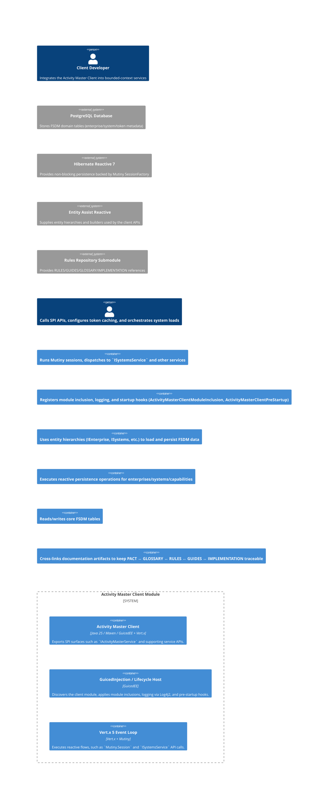

# C4 Container — Activity Master Client

## Narrative
- The **Activity Master Client** module is built as a Maven Java 25 artifact that exports SPI interfaces (`com.guicedee.activitymaster.fsdm.client.services.*`) and fluent CRTP helpers, relying on GuicedEE for wiring and lifecycle integration.
- **GuicedInjection** discovers the module via `ActivityMasterClientModuleInclusion`, applies `ConsoleLogActivityMasterProgressMaster`, and invites pre-startup hooks (`ActivityMasterClientPreStartup`).
- **Vert.x 5 / Mutiny** powers the runtime, supplying `Mutiny.Session` contexts consumed by `ISystemsService`, `ISystems`, and `ISystemToken` helpers while the module backs data with **Hibernate Reactive 7** against **PostgreSQL**.
- This repository documents the system via the **Rules Repository submodule** to close the loop across RULES, GUIDES, GLOSSARY, and IMPLEMENTATION, ensuring compliance with the adopted governance model.