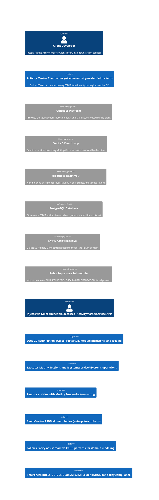

# C4 Context — Activity Master Client

## Narrative
- The **Activity Master Client** is a GuicedEE-aware library that exports a rich service API surface (`com.guicedee.activitymaster.fsdm.client.services.*`), including CRTP-driven fluent setters, reactive Uni-returning SPI operations, and system/token cache helpers.
- It relies on **GuicedEE** for dependency injection, service discovery, and lifecycle contributions (`ActivityMasterClientModuleInclusion`, `ActivityMasterClientPreStartup`).
- The runtime stack uses **Vert.x 5** event loops and **Hibernate Reactive 7** to ensure non-blocking access to the **PostgreSQL** implementation of the Financial Services Data Model (FSDM).
- This host repository consumes the **Rules Repository submodule** to stay aligned with enterprise-wide RULES/GUIDES/GLOSSARY/IMPLEMENTATION artifacts and closes loops between policy and execution.