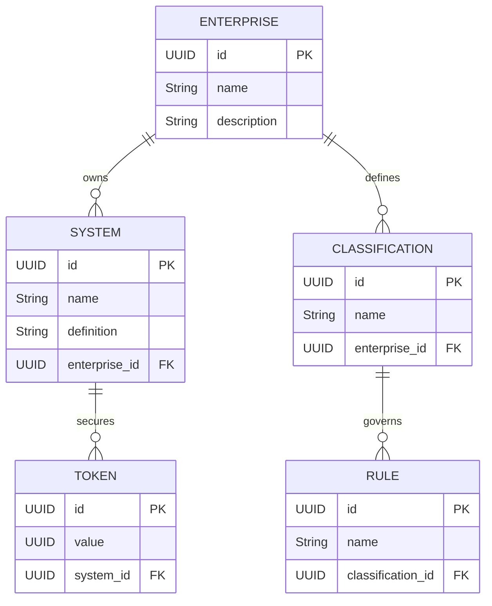
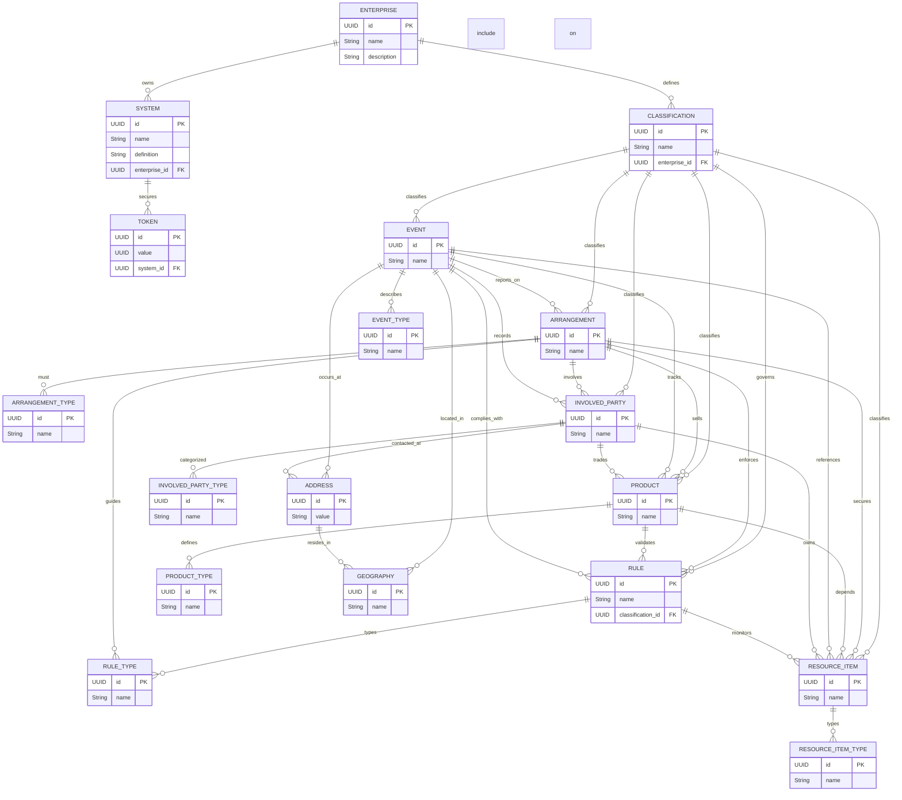

# ERD — Core Domain (Enterprise / Systems / Tokens)

## Narrative
- **ENTERPRISE** mirrors `IEnterprise<?,?>` and represents enterprises managed by `IEnterpriseService`. It owns systems, classifications, and is referenced by builders (`IEnterpriseQueryBuilder`, capabilities).
- **SYSTEM** corresponds to `ISystems<?,?>` entries handled by `ISystemsService` and `IActivityMasterService`, carrying metadata used when loading systems and generating tokens.
- **TOKEN** models security identity tokens cached in `IActivityMasterService.SYSTEM_TOKEN_CACHE` and fetched via `ISystemsService.getSecurityIdentityToken`.
- **CLASSIFICATION** and **RULE** align with the configuration APIs (`IClassificationService`, `IRulesService`, `IManageRuleTypes`, `IManageProducts`, `IManageEvents`, etc.) that assume classification-to-rule relationships within the enterprise.
- This ERD stays within the documented domain, using only elements directly traceable to `src/main/java/com/guicedee/activitymaster/fsdm/client/` interfaces and builders.
- **Row-level security** Every table row (and sensitive cells) carries a security token. Service methods accept trailing `UUID... identityToken` varargs; those identity tokens are evaluated to confirm that the caller holds permission to read/write the row via `ISecurityTokenService`. Token relationships are managed through the token hierarchy and grants (everyone/everywhere/administrators/etc.).
- **Classifications everywhere** Most domain tables implement `IManageClassifications`, which stores classification/value pairs (values up to 250 chars) that carry the meaningful business attributes for that row. Involved Parties include classifications on the party itself, its types, name types, and identification types; Arrangements and Arrangement Types, Products and Product Types, Resource Items and Resource Item Types, and similar pairs all persist their own classification values. This is the primary slicing mechanism in the canonical database and drives queries, routing, and policy rules across the domain. Each classification is anchored to a `Classification Data Concept`, which provides the context for the classification/value pair (see `IClassificationDataConceptService` for standard concepts).

## EntityAssist Query Builders
- EntityAssist is wired through the client SPI: each `I…Service` exposes a default `get()` that returns its query/builder instance already configured for EntityAssist (session, enterprise/system context, default flags). Clients outside ActivityMaster never see the underlying implementation classes—they only consume the interface plus its default methods.
- To retrieve a new type such as an involved party, obtain the builder via `IInvolvedPartyService#get()` (same pattern for every service) and drive reads/writes through that builder with the service methods handling the reactive session lifecycle.
- Services are responsible for database reads and writes; the `IManage…` interfaces are conveniences that keep the circular relationships in the canonical model coherent; the `IContains…` interfaces declare the default behavior and column sets for each type.

## Canonical Data & Bounded Contexts
ActivityMaster is the client-side surface for an expanded canonical data story that covers every institution that needs to keep disciplined records about entities, not only financial firms. The core domain acts as a reusable foundation for the domain-aware clients and systems that depend on it: every piece of data carries an explicit relationship to an enterprise, a system, or a classification rule, and the ERD above ensures that those references are always resolvable in code.

### Involved Party
The Involved Party data concept gathers every participant that touches an institution or is important to it—this includes the institution itself. Involved Parties are categorized into individuals, organizations, organization units, and employment positions:

- An **individual** is a person and may occupy employment positions or serve other roles.
- An **organization** usually binds multiple individuals or groups by a common purpose and can appear as a standalone entity in an Arrangement.
- An **organization unit** is a subset of an organization (such as a department) that may host jobs or workflows.
- An **employment position** is a post defined within an organization; it carries job functions, responsibilities, and authorities that individuals with that position will enact. Employment positions persist independently of the particular person filling them and may move between organization units over time.

Involved Parties declare relationships with the institution and with each other: for example, an individual may be employed by an organization, an organization can be a customer of another organization, and an organization unit may be the department for one or more employment positions. Parties can relate to Arrangements in several ways—their funds may satisfy the monetary side of an Arrangement, they may buy or sell Arrangements, they may negotiate terms, or they may participate as employees. Documenting those relationships in ActivityMaster ensures the client-side domain understands how participants, systems, and tokens interact in every bounded context.

### Arrangement
The Arrangement data concept captures every potential or actual agreement between two or more individuals, organizations, or organization units in which rules and obligations for exchanging goods, services, or resources are documented. Each Arrangement governs the conduct of business between the Financial Institution and other Involved Parties as they offer, sell, purchase, or obtain those service, good, or resource offerings.

In a typical example, a credit-worthy prospective customer seeks a loan Arrangement from the Financial Institution. The loan Arrangement is a sold product and inherits the product features and conditions outright or through special Conditions agreed between the parties. Those Conditions specify the disbursement amount, interest, collateral requirements, repayment timing, and other parameters. Documentation Items (also Resource Items) such as promissory notes, credit agreements, or security agreements are signed to record the Arrangement and capture the obligations of both customer and institution. Multiple Arrangements can result from any engagement to represent the distinct obligations each party holds.

Arrangements maintain close relationships to other Data Concepts. They explicitly name the Involved Parties participating in or affected by the business rules. Products and Resource Items are often the objects bought, sold, or contracted for under the Arrangement. Conditions express the terms, prices, and limits that are part of the agreement. One Arrangement can relate to another (for instance when packages are resold, or when a security is purchased for a trust). Business Direction Items define the goals, policies, schedules, and procedures used to execute the Arrangement while Resource Items document the contract and capture rating values that illustrate the Arrangement’s standing.

### Product
The Product data concept captures the goods and services—financial or otherwise—that a Financial Institution, its competitors, or other Involved Parties offer, sell, or buy during normal business. Products often depend upon resources (funds for loans, deposits, investments, trading, etc.) and correspond to the value-add activities such as deposit taking, lending, investing, or trading that a business performs for its customers. The concept is broad enough to include every offering that touches the institution’s operations, even if it primarily concerns marketing, demand, or cost information.

Products are tracked with metrics the institution cares about: development, maintenance, and advertising costs; demand and marketplace comparators; brand recognition; and income potential. Each Product records the Conditions that govern its terms, providing a reusable definition that adapts as product lines evolve. Arrangements that are “sold products” reuse the off-the-shelf Product definition and inherit its Conditions. Relationships to Involved Parties clarify who offers or acquires the Product, and Product-to-Product links express that a Product can be a packaged combination of other Products.

### Location
ActivityMaster keeps the Location data concept explicitly generic, acknowledging the client serves institutions beyond finance. A Location can be a physical place, a logical endpoint, or a bounded area whose contours are sanctioned by authorities or defined for internal business purposes. Addresses capture physical sites (residences or offices) or logical points (telephone numbers, SWIFT identifiers), while Geographic Areas represent externally designated regions (counties) or internally defined zones (statistical areas).

Relationships tie Locations to the rest of the canonical domain. The Involved Party–Location link records mailing and residential addresses, contact numbers, and the geographic area where an organization or individual is incorporated. Resource Items (documentation, assets, etc.) declare their Location through a Location–Resource Item relationship so that every document and resource has a resolvable place context.

### Classification
Classification organizes business information across the other canonical concepts by defining categorizations that describe individual instances or groups of concepts. One usage is classifying the occurrences themselves—e.g., tagging Involved Parties as organizations, individuals, manufacturers, accountants, or unmarried, or classifying Geographic Areas by their predominant business nature (agricultural, manufacturing, industrial, services). These classification structures make the domain richer for querying, routing, and policy enforcement.

Classification also captures broader groupings of data. Segments define market slices (for example, unmarried individuals earning a certain income in a regional metropolitan area) along with aggregated ratings, product selections, or risk indicators that describe the segment. The Accounting Area introduces Accounting Units that are governed by Accounting Categories and Structures. Accounting Units record tracked values for Resource Items, Arrangements, Business Direction Items, and others—e.g., the interest portion of a loan, the headcount of employees, or the count of ATMs operated by the institution. This dual role—classifying instances and grouping concepts—lets ActivityMaster reflect both fine-grained and aggregated policy knowledge in its core domain.

### Event
The Event data concept records happenings that the institution considers relevant to its mission—communications, accounting or maintenance transactions, posting entries, and other activities that explain how Plans, Policies, Procedures, Contracts, and Transactions are executed. Events capture metadata (who acted, what occurred, when, where, and whether follow-up work is needed) for actions initiated by customers, vendors, employees, and other Involved Parties. Sometimes those actions are triggered by communications, but communications may also be recorded separately if there is no attached transaction.

Events typically cover changes in Accounts, Involved Parties, Locations, or any other canonical concept. Accounting transactions log value changes, while maintenance transactions handle adds, updates, or deletes of the institution’s master data. Events link to Arrangements to capture communications about signing, transactions generated by the Arrangement, or its completion. They relate to Business Direction Items to chronicle progress toward plans, schedules, or milestones (e.g., posting an amount or completing a phase). Events can reference other Events so posting entries, event sequences in a trade, or ordered announcements (such as security issuances) are persistently auditable.

### Resource Item
Resource Items represent every tangible or intangible value item that institutions own, manage, use, or care about while operating. The concept covers uniquely identifiable physical goods (real property, buildings, furniture, equipment, vehicles, supplies) as well as less tangible resources (funds, stock, bonds, currencies, patents, trademarks, copyrights) and even the equity or asset portion of specific Arrangements (mortgages, insurance policies). Resource Items may be single objects or groups managed together, and they can include assets that belong to external Involved Parties but are of interest to the institution—collateral pledged for loans, leased facilities, valuables held for safekeeping, or goods offered for sale to the institution.

Many Resource Items arise from Arrangements: they may be pledged as collateral, managed under custodial agreements, or sold as part of an Arrangement’s execution (e.g., a building or equipment sale). The Involved Party–Resource Item relationship records ownership, lease status, collateral commitments, or custodial custody. The Location–Resource Item relationship documents where each Resource Item resides, ensuring that every recorded asset has a place context within ActivityMaster’s canonical domain.

## Full ERD
This ERD layers on top of the mermaid above to show every builder-backed table that participates in the canonical ActivityMaster client domain. Every entity exposed to consumers uses an `Ixxx` builder and the accompanying `IManage…` interfaces located under `src/main/java/com/guicedee/activitymaster/fsdm/client/services`. Many-to-many joins (e.g., `IManageArrangements`, `IManageProducts`, `IManageEvents`, `IManageResourceItems`, `IManageClassifications`, etc.) are implemented by auto-generated `IWarehouseRelationshipTable` subclasses whose names pair the two sides of the relationship (for example, `IManageArrangementsXArrangementType` or `IManageClassificationsXClassification`). The `IContains…` interfaces deliver the consistent `id`, `enterprise`, `system`, `active_flag`, and audit columns across every table. Arrangements are the one exception in the client API that always requires at least one `ArrangementType` relationship—`IManageArrangementTypes` enforces that the default type is present before the entity can be considered valid.

Every arrow in the diagram is backed by an `IManage…` interface pair so the client keeps these relationships consistent across systems. The `IContains…` family ensures tenants inherit fields such as UUID identifiers, enterprise/system context, active flags, default data payloads, and hierarchical references; look in `services/capabilities/contains` for the implementation of each column set. With the ERD above, you can trace how ActivityMaster spans institutions, arrangements, products, assets, events, and participants while keeping every relationship resolvable through the `Ixxx` builders.
