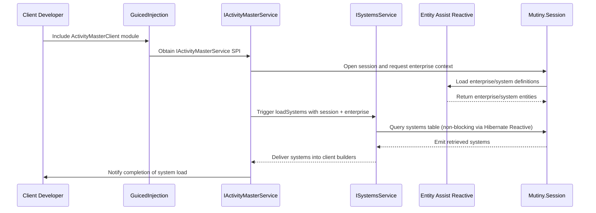

# Sequence — System Load Flow

## Narrative
1. The client developer wires the Activity Master Client module into GuicedInjection via `ActivityMasterClientModuleInclusion`.
2. GuicedInjection provides the `IActivityMasterService` SPI to host components.
3. Calls to `loadSystems` open `Mutiny.Session`, fetch enterprise context via Entity Assist-managed entities, and delegate to `ISystemsService`.
4. `ISystemsService` executes reactive queries (Hibernate Reactive 7 against PostgreSQL), streaming systems back into the client library.
5. The client library builds domain-specific objects and signals completion; token caches stay in sync for later operations.