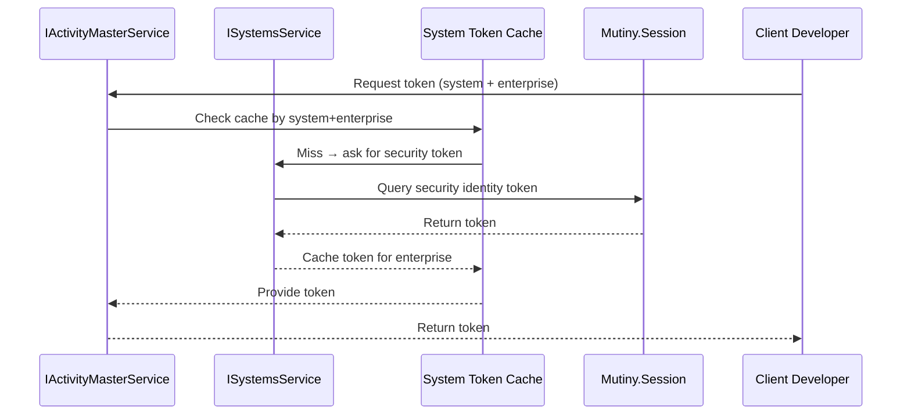

# Sequence — System Token Cache Flow



## Narrative
1. Client code requests a system token via `IActivityMasterService`.
2. The service checks the in-memory cache keyed by system name and enterprise ID (`SYSTEM_TOKEN_CACHE`).
3. On cache miss, it uses `ISystemsService.getSecurityIdentityToken`, which runs Hibernate Reactive queries inside a `Mutiny.Session`.
4. The retrieved token is cached and returned through the SPI to the client developer.

### Chaining guidance
The common flow:
```java
enterpriseService.getEnterprise(session, applicationName)
    .chain(ent -> IActivityMasterService.getISystem(session, SystemName, ent)
        .chain(sys -> IActivityMasterService.getISystemToken(session, SystemName, ent)));
```
Avoid deep nesting by bundling results as you go:
```java
enterpriseService.getEnterprise(session, applicationName)
    .chain(ent -> IActivityMasterService.getISystem(session, SystemName, ent)
        .chain(sys -> IActivityMasterService.getISystemToken(session, SystemName, ent)
            .map(token -> new Object[]{ent, sys, token})));
```
This keeps a single linear chain per `Mutiny.Session` while passing the enterprise/system/token together to downstream steps in one tuple. Prefer a small holder/record over a raw `Object[]` when possible, but the tuple approach avoids additional nested `chain` calls.***

### Session safety
Only one insert/update/delete may execute at a time on a `Mutiny.Session`. Keep write operations sequential on the same session—do not combine them in parallel (`Uni.combine()` on the same session) or spawn concurrent chains against that session. Reads that depend on prior writes should stay in-order within the same session to preserve consistency.
