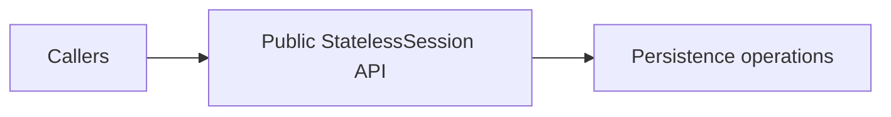

# Session API visibility

ActivityMaster's public persistence API uses `Mutiny.StatelessSession`.
Declarations accepting `Mutiny.Session`, including callback parameters
containing that type, must not be public entry points.

Removing stateful public overloads is a source and binary API break. Callers must
use stateless overloads and lifecycle helpers and pass their existing stateless
session through the operation. A stateful session cannot be cast to a stateless
session. Interface contracts must expose only the stateless variants.

Duplicate stateful declarations and implementations have been removed. Remaining
operations accept stateless sessions and use explicit insert/update operations.
Session helpers open stateless sessions; they no longer flush or clear a managed
persistence context. Callback parameters also use `Mutiny.StatelessSession`.

`SessionUtils.withSessionTx` and `SessionUtils.withSession` callers must use
`withStatelessSessionTx` and `withStatelessSession`, respectively. The remaining
context helpers retain their names and now supply stateless sessions.

Some stateless relationship mutations return `Uni<Void>`. Callers that need the
relationship itself must chain its lookup after the mutation completes.

This policy covers declarations owned by ActivityMaster, including its feature
modules. It does not alter methods inherited from external libraries or the
shared GuicedEE persistence factory lifecycle. `PublicSessionApiTest` checks
compiled ActivityMaster declarations, including generic callback signatures.
